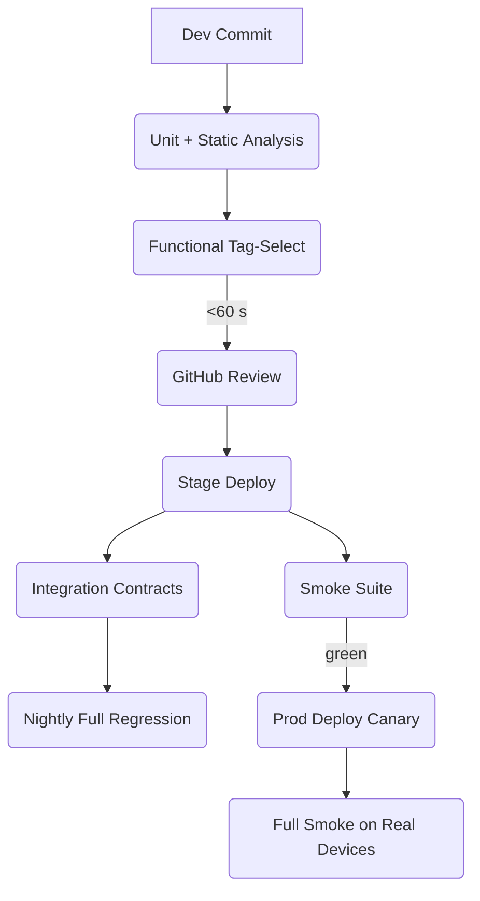

<div class="row">
  <div class="col-sm mt-3 mt-md-0 text-center">
    
  </div>
</div>

> _“Quality is a design parameter, not a phase.”_  
> This article dissects four pillars every SDET leans on—**Functional, Integration, Smoke, Regression**—and shows where they live in a pipeline, how they fail, and how to keep them cheap.

---

## 0 · Why Another Glossary?

Because most definitions are either _too academic_ (“black‑box verification of an externally visible behaviour…”) or _too shallow_ (“does the page load?”).  
Below you’ll find the _working_ definitions my teams and I have converged on after shipping several B2C mobile apps and microservice backends.

---

## 1 · Functional Tests

### _Validate a single feature in isolation—UI optional_

| Axis             | Detail                                                                                        |
| :--------------- | :-------------------------------------------------------------------------------------------- |
| **Scope**        | One user story / acceptance criterion                                                         |
| **Dependencies** | Mocked or stubbed (network, auth, payments…)                                                  |
| **Runtime**      | Target **< 500 ms** each, < 4 min suite                                                       |
| **Tooling**      | _Mobile:_ XCUITest / Espresso / Appium<br>_Backend:_ pytest‑requests, supertest, REST‑assured |

### 1.1 Example — iOS SwiftUI ViewModel

```swift
final class CartViewModelTests: XCTestCase {
    func test_addItem_updates_total() {
        let repo = FakeCatalogRepository()
        let vm   = CartViewModel(catalog: repo)

        vm.add(itemID: "capuccino", quantity: 2)

        XCTAssertEqual(vm.total, 7.0)    // local currency, tax‑free
        XCTAssertEqual(repo.hitCount, 1) // assert single repo call
    }
}
```

_The repository is a **fake** — no SQLite, no CoreData, no HTTP. That keeps the test deterministic and 6 × faster than touching real storage._

### 1.2 When Functional Tests Fail

- **Spec drift** — PM changed acceptance criteria but BDD/Gherkin not updated.
- **UI refactor** — UI test locators coupled to class names rather than semantic IDs.

**Guardrail**: enforce _semantic_ accessibility identifiers (`"CartTotalLabel"`, not `"label3"`).

---

## 2 · Integration Tests

### _Prove that contracts between two real components hold_

| Axis             | Detail                                                  |
| :--------------- | :------------------------------------------------------ |
| **Scope**        | API ↔ Service, Service ↔ DB, Publisher ↔ Subscriber  |
| **Dependencies** | Real on both ends, mock everything beyond               |
| **Runtime**      | 1–10 s each, < 10 min suite                             |
| **Tooling**      | Pact, TestContainers, Docker‑Compose, WireMock, grpcurl |

### 2.1 Example — Swift Consumer Pact Test

```swift
@PactTest(for: "PricingService", provider: "pricing-api")
func test_price_contract() throws {
    given("SKU capuccino exists")
        .uponReceiving("Price lookup")
        .path("/v1/prices/capuccino")
        .method("GET")
    willRespondWith {
        status(200)
        json([
            "sku": "capuccino",
            "price": 3.5,
            "currency": "USD"
        ])
    }

    let client = PricingClient(base: mockServer.url)
    let price  = try await client.price(for: "capuccino")
    XCTAssertEqual(price.amount, 3.5)
}
```

When the **provider** publishes its own verification, the Pact Broker guarantees you never ship a schema mismatch.

### 2.2 Integration Anti‑Patterns

| Smell                                      | Fix                                                                    |
| :----------------------------------------- | :--------------------------------------------------------------------- |
| _Database‑required tests mutate prod data_ | Spin DB in Docker, run migrations on launch (TestContainers).          |
| _Network flake from public QA env_         | WireMock record‑replay, run provider verification in pipeline instead. |

---

## 3 · Smoke Tests

### _Binary confidence check—no business logic, just “does it launch?”_

| Axis             | Detail                                                    |
| :--------------- | :-------------------------------------------------------- |
| **Scope**        | Health‑check endpoints, app start‑up, critical login flow |
| **Dependencies** | All real—including infra                                  |
| **Runtime**      | < 120 s total                                             |
| **Tooling**      | Appium (device + sim), curl, k6 smoke profile, Lighthouse |

### 3.1 Typical Mobile Smoke Suite (GitHub Actions)

| Step                | Command                                      | Duration |
| :------------------ | :------------------------------------------- | :------: |
| Provision simulator | `xcrun simctl boot "iPhone 15"`              |   8 s    |
| Install IPA         | `xcrun simctl install booted build/App.ipa`  |   3 s    |
| Launch check        | Appium script taps splash until home visible |   12 s   |
| Backend ping        | `curl https://api.stage.example.com/health`  |  0.1 s   |

**Rollback rule**: any red in this job aborts the deploy; no flaky retries.

---

## 4 · Regression Tests

### _Codified bug history—keep the zombies down_

> **Regression ≠ layer**. It’s a **label** attached to tests that reproduce previous defects.

| Axis             | Detail                                                                   |
| :--------------- | :----------------------------------------------------------------------- |
| **Scope**        | The minimal path that used to break                                      |
| **Dependencies** | Same as the original failure context                                     |
| **Runtime**      | Irrelevant; runs on feature branches modifying the file path             |
| **Tooling**      | Whatever layer originally missed the bug — unit, functional, integration |

### 4.1 Git Hygiene

```bash
# pytest.ini
[pytest]
markers =
    regression: previously reported defects
```

- On hot‑fix PRs, add `@pytest.mark.regression` to the new test.
- Nightly job ‑‑runs `pytest -m regression` first; if that suite goes green the full matrix follows.

### 4.2 Metrics to Watch

| KPI                                                               | Healthy | Action if unhealthy              |
| :---------------------------------------------------------------- | :-----: | :------------------------------- |
| **Regression coverage** (unique historical Jira IDs / total bugs) | ≥ 90 %  | Post‑mortem: mandate test in DoD |
| **Age of failing regression**                                     | 0 days  | CI gate + auto‑revert commit     |
| **Regression flake rate**                                         |  < 1 %  | Stabilise or quarantine          |

---

## 5 · Putting It All Together

### 5.1 Pipeline Blueprint (mobile + backend)



Every test type lives **once**, has a clear _gate_ responsibility, and a hardened _time budget_.

### 5.2 Cost ✕ Confidence Matrix

| Layer       | Failure Cost | Execution Cost | Confidence / min |
| :---------- | :----------: | :------------: | :--------------: |
| Unit        |     Low      |    Very Low    |   **Highest**    |
| Functional  |    Medium    |      Low       |       High       |
| Integration |     High     |     Medium     |      Medium      |
| Smoke       |   Critical   |    Very Low    |       High       |
| Regression  |  Historical  |     Varies     |    Priceless     |

When deadlines loom, you cut from the _right‑hand columns_, never the left.

---

## 6 · Advanced Patterns (for Those Who Already Have the Basics)

1. **Mutation Testing** – run _stryker‑swift_, _pitest_, or _mutmut_ nightly; mutants caught by functional tests reveal dead assertions.
2. **Contract Diff Alerts** – Git hook that fails PR if OpenAPI or Expo config changes without a matching pact update.
3. **Test Selection by Affected Paths** – run regression subset where `git diff` intersects the call‑graph; slashes PR runtime by 70 %.
4. **Chaos in Canary** – inject 30 % packet loss during smoke; if the app still loads, the UX team wins cookies.
5. **Shadow Production** – clone prod traffic to a dev flight build; treat unexpected 5xx as integration failures in real time.

---

## 7 · Common Pitfalls (And Cheap Fixes)

| Pitfall                                                       | Why It Hurts                             | Mitigation                                                |
| :------------------------------------------------------------ | :--------------------------------------- | :-------------------------------------------------------- |
| **Over‑mocking** in functional tests hides serialization bugs | Object misspells field, prod returns 422 | Add JSON schema validation in integration layer           |
| **Un‑tagged** regression tests                                | Hard to isolate during hot‑fix           | Enforce `@regression` marker in PR template               |
| **Smoke suite grows** into full E2E                           | Pipeline slows, teams bypass it          | 120‑second guardrail scripts fail build if exceeded       |
| **DB resets** on every integration run                        | 3 × run‑time                             | Wrap tests in one TestContainer, rollback via transaction |
| **Flaky accessibility IDs** driven by UI text                 | Localization breaks locators             | Use _semantic_ IDs; assert existence in unit tests        |

---

## 8 · Cheat‑Sheet for Interview Whiteboards

```text
Layer        Boundary            Mocks?   Trigger      Budget   Failure Action
-----------  ------------------  -------  -----------  -------  -------------------
Unit         Single class/file   All      PR           < 30 s   fix before merge
Functional   Feature slice       External PR & Nightly < 4  m   fix / revert PR
Integration  Two real services   None     Nightly      < 10 m   block release
Smoke        Full stack, narrow  None     Deploy       < 2  m   auto‑rollback
Regression   Historical bug      Context  Branch‑/Night Varies  hot‑fix must pass
```

Memorise the middle column; recruiters love boundary talk.

---

## 9 · Key Takeaways

- **Test type = risk vector** – choose the layer that kills the costliest uncertainty first.
- **Labels, not silos** – “regression” and “smoke” cross‑cut layers; don’t duplicate code, duplicate intent.
- **Time budgets** keep CI honest; every extra second steals throughput from your team.
- **Accessibility IDs** pay double—stable locators for automation, inclusive UX for users.
